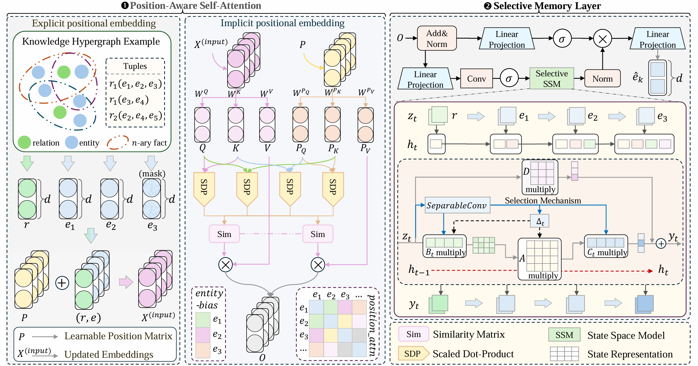

<h1 align="center">
  HMTE
</h1>
<h4 align="center">HMTE: Memory-Transformer Representation Learning for Knowledge Hypergraph Completion</h4>

<h2 align="center">
  Overview of HMTE
  
</h2>

This paper has been submitted to the Neurocomputing.

### Dependencies

- python            3.10.13
- torch             2.1.1+cu118
- mamba-ssm         2.2.2
- numpy             1.26.3
- transformers      4.44.1

### Dataset:

- We use JF17K, WikiPeople, and FB-AUTO dataset for knowledge hypergraph link prediction. 
- You should first download the preprocessed data and put them in the `./data` directory.

### Results:
The results are:

|  Dataset   |  MRR  |  H@1  |  H@3  | H@10  |
| :--------: | :---: | :---: | :---: | :---: |
|   JF17K    | 0.600 | 0.525 | 0.634 | 0.747 |
| WikiPeople | 0.451 | 0.374 | 0.492 | 0.588 |
|  FB-AUTO   | 0.880 | 0.862 | 0.890 | 0.911 |

## How to Run
```
python main-JF17K.py                 ## JF17K dataset
python main-WikiPeople.py            ## WikiPeople dataset
python main-FB-AUTO.py               ## FB-AUTO dataset
```
